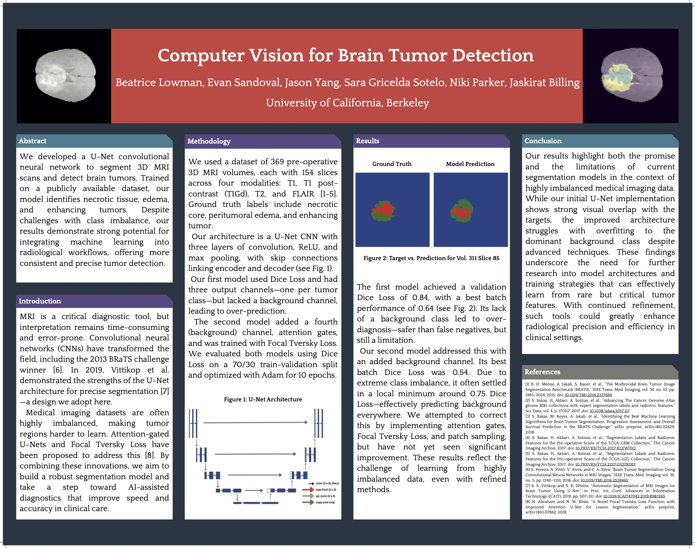

# computer-vision-tumor-detection
Fall 2024 - Spring 2025 software project involving segmentation of 3D MRI scans for tumor identification. 

This repo contains data pipeline, U-NET FCN architecture, and training loop. Below see poster materials from California Neurotechnology Conference 2025:

  
